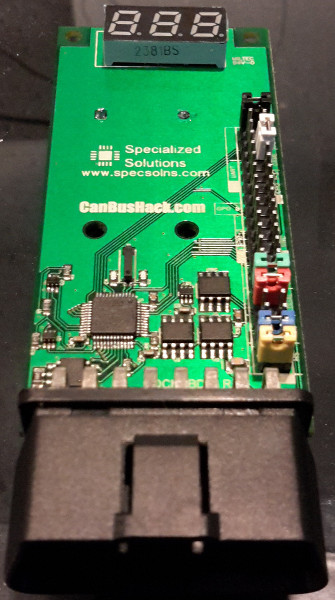
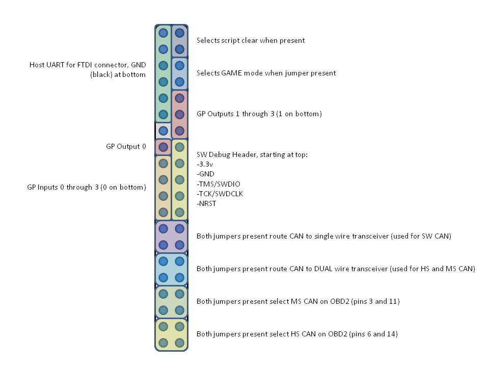

# CHVBadge

## Official Website
http://www.carhackingvillage.com/

## Dev Enviroment
The SDK requires a Windows machine with Visual C++ Redistributable to be installed.
I used a VM from [modern.ie](http://dev.modern.ie/tools/vms/), and installed [Visual C++ Redistributable Packages for Visual Studio 2013](http://www.microsoft.com/en-US/download/details.aspx?id=40784).
If you use the SDK provided from carhackingvillage.com you may need to delete msvcr110.dll and msvcr120.dll so that the versions installed from C++ Redistributable will be used.

### FTDI Driver
If you don't have it already install an FTDI driver to program the device.
I used version 2.10.00 from here http://www.ftdichip.com/Drivers/VCP.htm. (The latest version had driver signature issues on my VM)

Note: The version of QCMLoader that is provided by carhackingvillage.com only works with a specific FTDI cable.
The version included in this repository should work with any FTDI cable (I used a BusPirate). Thanks to [jhub908](https://twitter.com/jhub908) for providing me with the newer version.

[BusPirate Instructions Here](BusPirate.md)

## Serial Settings
* BaudRate: 230400
* Data: 8 bit
* Parity: None
* Stop: 1bit
* Flow Control: None

## Pinout

## SocketCan

Use the Badge as a CAN based network interface in Linux!
[More info Here](SocketCan.md)

